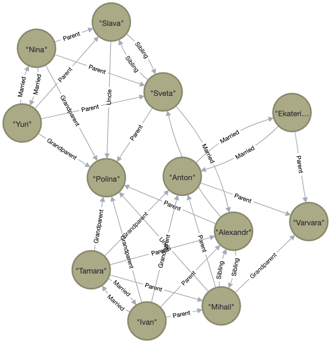

## На защите (Ю.В.):  
- Написать 4 запроса. Каждый на РЕЯ (русский естественный язык), prolog, Neo4j  
- ER диаграмма сущностей  

[Neo4j](https://login.neo4j.com/u/login/identifier?state=hKFo2SBONVVUMEE4bDlURnRFUDNhVlVVRjA3ajhzbzdhd19RQaFur3VuaXZlcnNhbC1sb2dpbqN0aWTZIFJrd2Zoa3ZwcWJtRUxLbjdrREtmR0ZrLXJ6OEtqdjdzo2NpZNkgV1NMczYwNDdrT2pwVVNXODNnRFo0SnlZaElrNXpZVG8) - графовая БД. Всё можно потыкать в онлайне.  

— Заполнить базу знаний  
```Neo4j
CREATE (polina:Person {name: "Polina", sex: "female"}),
(svetlana:Person {name: "Sveta", sex: "female"}),
(alexandr:Person {name: "Alexandr", sex: "male"}),
(nina:Person {name: "Nina", sex: "female"}),
(yuri:Person {name: "Yuri", sex: "male"}),
(tamara:Person {name: "Tamara", sex: "female"}),
(ivan:Person {name: "Ivan", sex: "male"}),
(slava:Person {name: "Slava", sex: "male"}),
(mihail:Person {name: "Mihail", sex: "male"}),
(anton:Person {name: "Anton", sex: "male"}),
(ekaterina:Person {name: "Ekaterina", sex: "female"}),
(varvara:Person {name: "Varvara", sex: "female"}),

(svetlana)-[:Parent]->(polina),
(alexandr)-[:Parent]->(polina),
(tamara)-[:Parent]->(alexandr),
(ivan)-[:Parent]->(alexandr),
(tamara)-[:Parent]->(mihail),
(ivan)-[:Parent]->(mihail),
(nina)-[:Parent]->(svetlana),
(yuri)-[:Parent]->(svetlana),
(nina)-[:Parent]->(slava),
(yuri)-[:Parent]->(slava),
(ekaterina)-[:Parent]->(varvara),
(anton)-[:Parent]->(varvara),
(mihail)-[:Parent]->(anton),

(tamara)-[:Grandparent]->(polina),
(ivan)-[:Grandparent]->(polina),
(nina)-[:Grandparent]->(polina),
(yuri)-[:Grandparent]->(polina),
(tamara)-[:Grandparent]->(anton),
(ivan)-[:Grandparent]->(anton),
(mihail)-[:Grandparent]->(varvara),

(mihail)-[:Uncle]->(polina),
(slava)-[:Uncle]->(polina),

(mihail)-[:Sibling]->(alexandr),
(alexandr)-[:Sibling]->(mihail),
(slava)-[:Sibling]->(svetlana)
(svetlana)-[:Sibling]->(slava),

(svetlana)-[:Married]->(alexandr),
(alexandr)-[:Married]->(svetlana),
(anton)-[:Married]->(ekaterina),
(ekaterina)-[:Married]->(anton),
(ivan)-[:Married]->(tamara),
(tamara)-[:Married]->(ivan),
(yuri)-[:Married]->(nina),
(nina)-[:Married]->(yuri);
```

— Нарисовать всё  
```neo4j
MATCH p=()-[:Grandparent|Married|Parent|Sibling|Uncle|Aunt]->() RETURN p LIMIT 50;
```



— Удалить все  
```neo4j
MATCH (n) DETACH DELETE n
```

— Родители Полины  
```neo4j
MATCH (p1:Person)-[:Parent]->(p2:Person{name:"Polina"}) RETURN p1.name
% Svetlana 
% Alexandr 
```

— Мама Варвары  
```neo4j
MATCH (p2:Person{sex:"female"})-[:Parent]->(p1:Person{name:"Varvara"}) RETURN p2.name
% Ekaterina 
```

— Дедушки Полины  
```neo4j
MATCH (p3:Person{sex:"male"})-[:Parent]->(p2:Person)
MATCH (p2:Person)-[:Parent]->(p:Person{name:"Polina"})
 RETURN p3.name
% Yuri 
% Ivan
```

— Все женатые пары  
```neo4j
MATCH p=()-[:Married]->() RETURN p LIMIT 20;
```

— Двоюродные братья и сестры Антона  
```neo4j
MATCH (p4:Person{sex:"male"})-[:Parent]->(p5:Person)
MATCH (p3:Person{sex:"male"})-[:Parent]->(p4:Person)
MATCH (p3:Person{sex:"male"})-[:Parent]->(p2:Person)
MATCH (p2:Person)-[:Parent]->(p:Person{name:"Polina"})
 RETURN p5.name
% Polina
```

— Бабушка и дедушка Полины по маме  
```neo4j
MATCH (p1:Person)-[:Parent]->(p2:Person{sex:"female"})
MATCH (p1:Person)-[:Grandparent]->(p:Person{name:"Polina"})
 RETURN p1.name
% Nina
% Yuri
```
